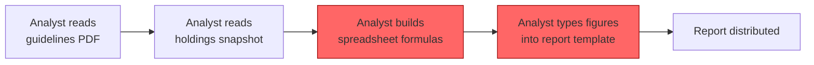
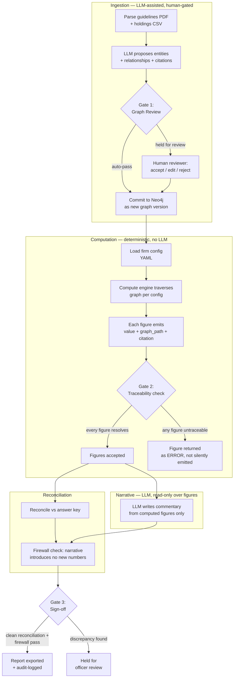

# Flow (AS-IS / TO-BE) and Audit Event Catalogue

## 1. AS-IS: how the report gets made today

Everything from C onward is manual, un-versioned, and undocumented. The "audit trail" is
whatever the analyst remembers about a formula three tabs deep in a working file. There is no
provenance, no reproducibility guarantee, and no way to answer "where did this number come
from?" except by asking the person who typed it.

## 2. TO-BE: system flow with autonomy / human-review gates

### Gate criteria (auto-pass vs. human review)

| Gate | Sits between | Auto-pass criterion | Routed to human when |
|---|---|---|---|
| **Gate 1 — Graph Review** | Extraction → Graph commit | Every proposed node/edge has `extraction_confidence ≥ 0.85` **and** a resolved `SOURCED_FROM` citation **and** passes schema validation (required properties present, no orphan edges) | Any node/edge below the confidence threshold, missing a citation, failing schema validation, or flagged as a duplicate/conflicting entity (e.g. two different `parent_issuer` values for the same issuer across ingestion runs) |
| **Gate 2 — Traceability check** | Figure computation → Figure acceptance | The figure's `graph_path` resolves end-to-end to a `SourceChunk` with a non-null citation | The path is broken, a required graph node is missing, or the config references a rule the graph can't satisfy (e.g. a GRE grouping rule applied to an issuer with no `parent_issuer` edge) — the figure is emitted as an explicit `ERROR`, never silently dropped or estimated |
| **Gate 3 — Sign-off** | Reconciliation/firewall → Export | Reconciliation vs. answer key within stated tolerance **and** firewall check finds zero LLM-introduced numbers **and** zero Gate-2 errors outstanding | Any reconciliation delta outside tolerance, any firewall violation, or any unresolved traceability error — held for an approving officer, per guideline §5.1's "documented justification and re-approval" requirement |

This mirrors the guideline document's own control language almost exactly (§5.1: source
provenance, transformation log, version control, immutability, retention) — the TO-BE flow is
essentially a machine-executable implementation of what MAM-FI-2024-GL-007 already demands of a
human process.

## 3. Audit event catalogue

Every event below is appended to the audit log (see `docs/03_rfc.md` §5 for the append-only
mechanism). No event is ever updated or deleted after insertion.

| Event | Trigger | Data Captured | Retention |
|---|---|---|---|
| `GRAPH_INGESTED` | New extraction run completes and passes/fails Gate 1 | `run_id`, source doc hashes, node/edge counts, `extraction_confidence` distribution, gate outcome (auto-pass / held), graph version id | 7 years (transaction-data class, per guideline §5.1) |
| `GRAPH_NODE_REVIEWED` | Human accepts, edits, or rejects a held node/edge at Gate 1 | `run_id`, node/edge id, reviewer identity, action taken, before/after values, timestamp | 7 years |
| `FIGURE_COMPUTED` | Compute engine emits a figure (Phase 3) | `figure_id`, `firm_config_id`, `value`, `graph_path`, `citation`, engine version hash, input graph version, timestamp | 7 years |
| `FIGURE_TRACE_ERROR` | Gate 2 fails for a figure | `figure_id`, reason (broken path / missing citation / unsupported config rule), graph version, timestamp | 7 years |
| `RECONCILIATION_RUN` | Reconciliation script executes against an answer key | `run_id`, per-figure pass/fail + delta, overall pass rate, answer-key file hash, timestamp | 10 years (investor/regulatory-report class) |
| `NARRATIVE_GENERATED` | LLM produces commentary text over accepted figures | `run_id`, prompt hash, model + version, output text hash, list of figure_ids it was given | 7 years |
| `FIREWALL_CHECK_RUN` | Firewall check compares narrative text's numeric tokens against computed figure set | `run_id`, numbers found in narrative, numbers matched to computed figures, any unmatched number (= violation), pass/fail | 7 years |
| `CONFIG_CHANGED` | A firm config file is loaded/switched (e.g. Firm A → Firm B) | `config_id`, firm name, config file hash, prior config_id (if any), who/what triggered the switch, timestamp | 10 years |
| `REPORT_EXPORTED` | Final populated report is written out | `run_id`, `report_version`, config_id used, graph_version used, output file hash, Gate 3 outcome, approving officer (if held for review) | 10 years (investor-facing report class, per guideline §4) |

Retention periods are taken directly from guideline §5.1 ("7 years for transaction data and 10
years for investor-facing reports") rather than invented — the audit log's retention policy is
itself traceable back to a source passage, same as any report figure.
