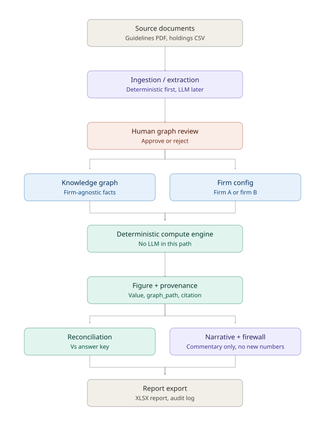
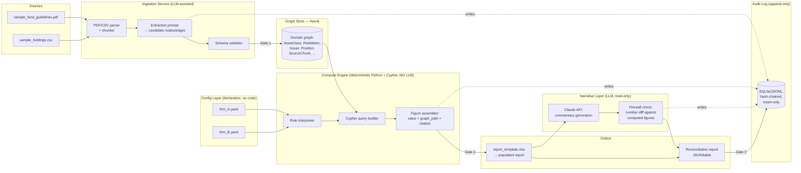

# Architecture

## 1. Component overview



*Static image above for portability (renders in any viewer); the Mermaid source below is the same diagram, and renders natively on GitHub.*



**Key structural guarantee (constraint 3):** the Narrative Layer's only input is the *already
computed* figure set (immutable, already written to the audit log). It has no graph access, no
CSV access, and no arithmetic capability exposed to it — it is a pure text-generation step
downstream of the numbers, not a participant in producing them. The firewall check makes this
provable rather than assumed (see RFC §3).

## 2. Why Neo4j

The domain is genuinely graph-shaped, not tree- or table-shaped:

- Issuers roll up to parent issuers (Redhill Power / Redhill Transport → Redhill Holdings) —
  variable-depth aggregation.
- Asset classes contribute to cross-cutting aggregates (High Yield + Structured Credit → "non-IG
  exposure") — a many-to-many CONTRIBUTES_TO relationship, not a column.
- Risk metrics connect to thresholds, breach actions, *and* owners — a 3+ hop path answers "what
  happens and who's told if duration breaches?"
- Every node/edge needs a provenance edge to a source chunk — doubling the edge count but keeping
  traversal (not string search) as the only way to answer "where did this come from?"

Neo4j gives native multi-hop traversal (Cypher `MATCH` paths become the literal `graph_path`
string returned in each figure), built-in path queries for the audit "follow one figure end-to-
end" test, and a clean mental model for firm-config rules that add/change *traversal patterns*
without touching the underlying facts.

## 3. Graph schema

### Node labels and key properties

| Label | Key properties |
|---|---|
| `:AssetClass` | `name`, `min_allocation`, `max_allocation`, `notes` |
| `:Aggregate` | `name` (e.g. `non_ig_exposure`), `cap_pct` |
| `:RiskMetric` | `name`, `limit_min`, `limit_max`, `unit`, `monitoring_frequency` |
| `:ConcentrationCap` | `name` (`single_issuer`, `gre_issuer`, `counterparty`), `cap_pct`, `scope` |
| `:LiquidityRequirement` | `floor_normal_pct`, `floor_stress_pct`, `stress_definition` |
| `:BreachAction` | `description`, `sla`, `escalation_path` |
| `:Owner` | `role_name` (e.g. "Risk & Compliance Committee", "CRO") |
| `:Issuer` | `name`, `issuer_type` (`government`/`corporate`/`GRE`/`spv`/`cash`) |
| `:Position` | `instrument_id`, `instrument_name`, `market_value_sgd`, `modified_duration`, `credit_rating`, `downgraded_from` |
| `:SourceDocument` | `doc_id`, `filename`, `version` |
| `:SourceChunk` | `chunk_id`, `page`, `text_summary`, `ingestion_time`, `extraction_confidence` |

### Relationship types

| Relationship | From → To | Meaning |
|---|---|---|
| `:BELONGS_TO` | `Position` → `AssetClass` | position's allocation bucket |
| `:ISSUED_BY` | `Position` → `Issuer` | who issued the instrument |
| `:ROLLS_UP_TO` | `Issuer` → `Issuer` | GRE child → parent issuer (`parent_issuer` column) |
| `:CONTRIBUTES_TO` | `AssetClass` → `Aggregate` | static rule: HY and Structured Credit always contribute to non-IG |
| `:GOVERNED_BY` | `AssetClass` → itself has limit props; `RiskMetric`/`ConcentrationCap`/`LiquidityRequirement` are standalone limit nodes referenced directly by the compute layer |
| `:HAS_THRESHOLD` | `RiskMetric` → embedded in node props (kept flat; a separate `Threshold` node was considered and rejected — no independent identity or provenance beyond the metric itself) |
| `:TRIGGERS` | `RiskMetric` / `AssetClass` → `BreachAction` | what happens on breach |
| `:OWNED_BY` | `BreachAction` → `Owner` | who is notified / responsible |
| `:SOURCED_FROM` | *any domain node* → `SourceChunk` | provenance edge — mandatory on every node |
| `:PART_OF` | `SourceChunk` → `SourceDocument` | chunk's parent document |

### Example Cypher — schema constraints

```cypher
CREATE CONSTRAINT position_id IF NOT EXISTS FOR (p:Position) REQUIRE p.instrument_id IS UNIQUE;
CREATE CONSTRAINT issuer_name IF NOT EXISTS FOR (i:Issuer) REQUIRE i.name IS UNIQUE;
CREATE CONSTRAINT chunk_id IF NOT EXISTS FOR (c:SourceChunk) REQUIRE c.chunk_id IS UNIQUE;
CREATE CONSTRAINT assetclass_name IF NOT EXISTS FOR (a:AssetClass) REQUIRE a.name IS UNIQUE;
```

### Example multi-hop query (the brief's worked example)

*"What is the breach action if portfolio duration exceeds its limit, and who is notified?"*

```cypher
MATCH (m:RiskMetric {name: "Portfolio Modified Duration"})-[:TRIGGERS]->(a:BreachAction)-[:OWNED_BY]->(o:Owner)
MATCH (m)-[:SOURCED_FROM]->(c:SourceChunk)-[:PART_OF]->(d:SourceDocument)
RETURN m.limit_min, m.limit_max, a.description, a.sla, o.role_name, c.page, c.chunk_id, d.filename
```

This returns the answer *and* its citation in one traversal — the pattern every figure's
`graph_path` in Phase 3 follows.

### Example figure trace (aggregate non-IG exposure, Firm A default)

```cypher
MATCH (ac:AssetClass)-[:CONTRIBUTES_TO]->(agg:Aggregate {name: "non_ig_exposure"})
MATCH (p:Position)-[:BELONGS_TO]->(ac)
MATCH (agg)-[:SOURCED_FROM]->(chunk:SourceChunk)-[:PART_OF]->(doc:SourceDocument)
RETURN ac.name, sum(p.market_value_sgd) AS exposure, agg.cap_pct, chunk.page, chunk.chunk_id, doc.filename
```

Firm B's variant (rule 1: fallen angels) is the **same graph**, different traversal — see RFC §4
for how the config layer expresses this without a code change.

## 4. Repository layout

See `docs/00_project_plan.md` for the full tree and the reasoning behind it. In short: `src/` is
split by architectural boundary — `ingestion/` (deterministic PDF/CSV parsing, Day 2) is separate
from `extraction/` (LLM-assisted structuring, added Day 6 at the same boundary), `graph/` and
`configuration/` are the two things `computation/` reads, and the LLM is sandboxed into
`narrative/` (read-only over computed figures) and `extraction/` (gated by human review, never
read directly by `computation/`). `audit/` is append-only and touched by every module but owned by
none of them.

## 5. Tech stack

| Layer | Choice | Why |
|---|---|---|
| Language | Python 3.12+ | Matches existing gunicorn/FastAPI backends already run in production |
| Graph store | Neo4j 5.x Community (official Docker image) | Native Cypher traversal gives a literal `graph_path`; direct fit for constraint 2's "figure → graph path → source" evaluation |
| Graph driver | `neo4j` official Python driver (Bolt) | Standard, well-documented |
| Audit log | SQLite via stdlib `sqlite3`, no ORM, `BEFORE UPDATE`/`BEFORE DELETE` triggers with `RAISE(ABORT, ...)` | Database-level immutability, not just application-level discipline |
| Domain models & config validation | Pydantic v2 | Enum-constrained `method` fields make it structurally impossible for a firm config to invent new logic — the type-system enforcement of "config selects, never defines" |
| Config format | YAML (`PyYAML`) parsed into Pydantic models | Human-readable, diffable |
| Holdings processing | Stdlib `csv` + `decimal.Decimal` — not pandas | Pandas defaults numeric columns to `float64`, which conflicts with the "never float in a reported figure" numeric policy (`docs/00_metric_catalog.md`); 13 rows don't need a dataframe library |
| PDF extraction | PyMuPDF (`fitz`) | Reliable page-level text extraction with page numbers, feeding `source_page` provenance directly |
| Excel read/write | openpyxl | Already verified against the real answer key and report template |
| LLM (Day 6 only) | Anthropic Claude via the `anthropic` SDK, structured/tool-use output matched to a Pydantic schema | Structured entities out, not prose; brief permits any frontier API |
| CLI | Typer | Auto-generated `--help` and clean subcommands (`ingest`, `compute`, `reconcile`, `export`) support the "clone to result in minutes" README requirement |
| Hashing (audit chain) | Stdlib `hashlib` (SHA-256) | No dependency needed for hash-chaining log entries |
| Testing | pytest | Matches the `tests/` layout in `docs/00_project_plan.md` |
| Containerization | Docker + `docker-compose.yml` | Neo4j service + app service, same pattern as the existing droplet stack |

Explicitly left out: **FastAPI** (no core requirement needs a web server — reserved only for a
Day 7 bonus replay viewer if time allows) and **NetworkX** (superseded by the Neo4j decision
above; NetworkX was the lower-risk alternative but shifts risk from infra to hand-written graph
logic, which is worse for constraint 2's traceability requirement).
